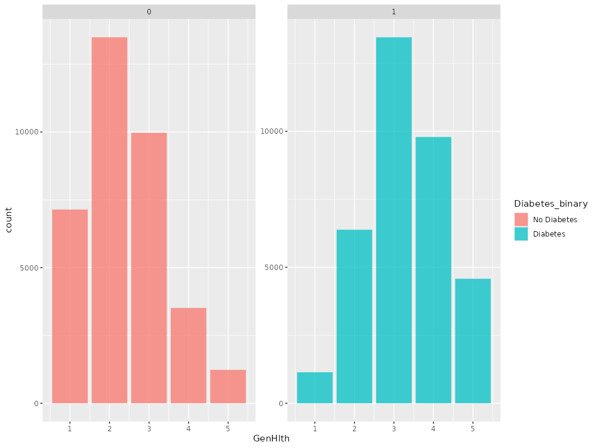
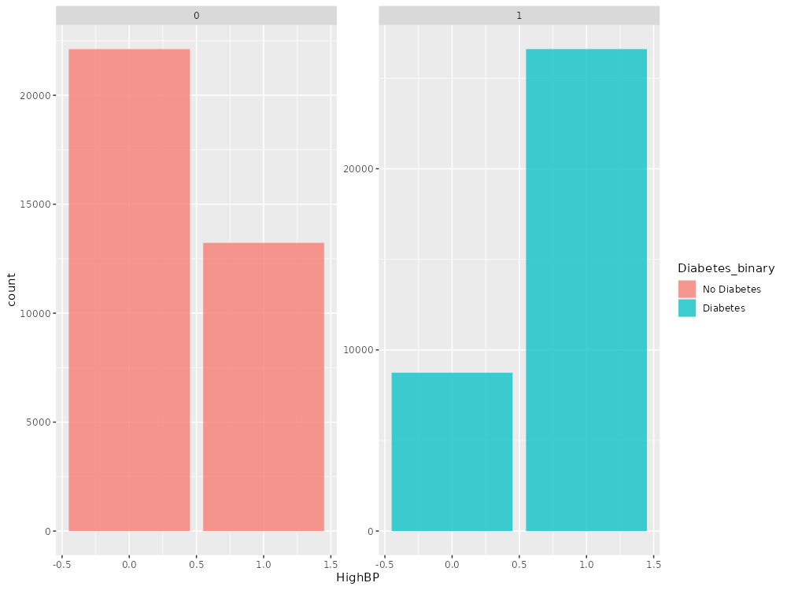

# Intro

First Lets see what data says about unrelated variable(to be predicted variable).

```{r}
base_folder <- "/home/cafebazaar/R-Projects/diabet/" # change this:)
data_folder <- paste0(base_folder, "data/")
output_folder <- paste0(base_folder, "output/")

diabetes_012_path <- paste0(data_folder,"diabetes_012_health_indicators_BRFSS2015.csv")
diabetes_binary_5050_path <- paste0(data_folder, "diabetes_binary_5050split_health_indicators_BRFSS2015.csv")
diabetes_binary_path <- paste0(data_folder, "diabetes_binary_health_indicators_BRFSS2015.csv")


library(data.table)
library(ggplot2)
library(readxl)
```

## Data

Let's have a look at data summery to see what we got!

```{r}
dt_5050 <- data.table(read.csv(diabetes_binary_5050_path))

summary(dt_5050)
```


## Correlation
To get some info and intuition about features we get correlation matrix of data to understand and analyse it.


We can see that some features have good correlation with diabetes binary. So we can explore more to find out more about our features and data.

## Feature Distribution diabetes vs no-diabetes

### BMI


As we can see people with higher BMI are more likely to have Diabetes.We can use this feature to predict whether someone has diabetes or not.

### General Health



Is more shifted to right meaning people with diabetes have worse general health condition than others. people who answered they have poor health have a strong indication of diabetes. For example if we classify based on category 4,5 our accuracy can be good but this is a simple model with more complex models and more tuning we can predict the answer.

### High Blood Pressure




Having High blood pressure is a good indicator for diabetes people with high blood pressure are more likely to have diabetes!


# Conclusion

We can clearly see that this data can say a lot about the to be predicted variable(diabetes binary). We showed 3 great predictors so there is good reason to believe we can have a nice enough prediction using this data.