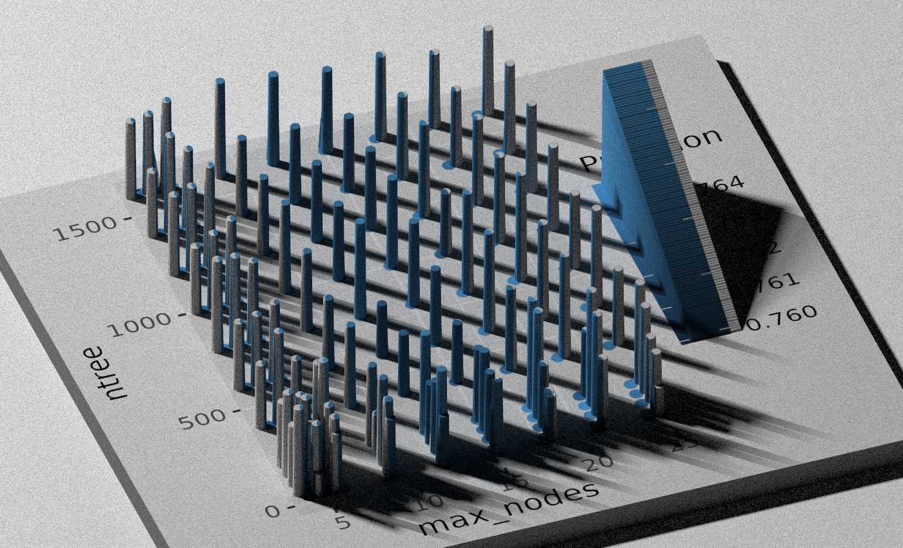

## Question 5 answer

Yes, we can. In question 3 and 4 we demonstrated that we can use fewer predictors in order to reduce complexity of the model. Our model was within 2% of performance of full model with 1/4 of predictors. In order to run on web browser we need to make our model more compact in order to do so we can either create fewer tree or prune our trees more meaning choose a smaller value of *max_node* parameter. Now lets draw some plots to see how much each of them effects performance we'll be measuring performance using F-Score and 10-fold cross validation on balanced data.

### importing libraries
```{r}
base_folder <- "/home/amirsalar/Diabetes-R/" # change this:)

data_folder <- paste0(base_folder, "data/")
output_folder <- paste0(base_folder, "output/")

diabetes_012_path <- paste0(data_folder,"diabetes_012_health_indicators_BRFSS2015.csv")
diabetes_binary_5050_path <- paste0(data_folder, "diabetes_binary_5050split_health_indicators_BRFSS2015.csv")
diabetes_binary_path <- paste0(data_folder, "diabetes_binary_health_indicators_BRFSS2015.csv")

library(data.table)
library(ggplot2)
library(readxl)
library(corrplot)
library(forcats)
library(gbm)
library(caret)
library(doParallel)
library(randomForest)
library(pROC)
library(verification)

dt_012 <- data.table(read.csv(diabetes_012_path))
dt_5050 <- data.table(read.csv(diabetes_binary_5050_path))
dt <- data.table(read.csv(diabetes_binary_path))

dt_5050 <- dt_5050[, Diabetes_binary := as.factor(Diabetes_binary)]
dt <- dt[, Diabetes_binary := as.factor(Diabetes_binary)]
```


### Effect of max nodes
```{r}
customRF <- list(label = "Random Forest",
                 library = "randomForest",
                 loop = NULL,
                 type = c("Classification", "Regression"),
                 parameters = data.frame(parameter = c("mtry", "ntree", "max_nodes"),
                                         class = c("numeric", "numeric", "numeric"),
                                         label = c("mtry", "ntree", "max_nodes")),
                 grid = function(x, y, len = NULL, search = "grid") {},
                 fit = function(x, y, wts, param, lev, last, classProbs, ...)
                   randomForest::randomForest(x, y, mtry = param$mtry, ntree=param$ntree, max_nodes=param$max_nodes,  ...),
                 predict = function(modelFit, newdata, submodels = NULL)
                   if(!is.null(newdata)) predict(modelFit, newdata) else predict(modelFit),
                 prob = function(modelFit, newdata, submodels = NULL)
                   if(!is.null(newdata)) predict(modelFit, newdata, type = "prob") else predict(modelFit, type = "prob"),
                 predictors = function(x, ...) {
                   ## After doing some testing, it looks like randomForest
                   ## will only try to split on plain main effects (instead
                   ## of interactions or terms like I(x^2).
                   varIndex <- as.numeric(names(table(x$forest$bestvar)))
                   varIndex <- varIndex[varIndex > 0]
                   varsUsed <- names(x$forest$ncat)[varIndex]
                   varsUsed
                 },
                 varImp = function(object, ...){
                   varImp <- randomForest::importance(object, ...)
                   if(object$type == "regression") {
                     if("%IncMSE" %in% colnames(varImp)) {
                       varImp <- data.frame(Overall = varImp[,"%IncMSE"])
                     } else {
                       varImp <- data.frame(Overall = varImp[,1])
                     }
                   }
                   else {
                     retainNames <- levels(object$y)
                     if(all(retainNames %in% colnames(varImp))) {
                       varImp <- varImp[, retainNames]
                     } else {
                       varImp <- data.frame(Overall = varImp[,1])
                     }
                   }

                   out <- as.data.frame(varImp, stringsAsFactors = TRUE)
                   if(dim(out)[2] == 2) {
                     tmp <- apply(out, 1, mean)
                     out[,1] <- out[,2] <- tmp
                   }
                   out
                 },
                 levels = function(x) x$classes,
                 tags = c("Random Forest", "Ensemble Model", "Bagging", "Implicit Feature Selection"),
                 sort = function(x) x[order(x[,1]),],
                 oob = function(x) {
                   out <- switch(x$type,
                                 regression =   c(sqrt(max(x$mse[length(x$mse)], 0)), x$rsq[length(x$rsq)]),
                                 classification =  c(1 - x$err.rate[x$ntree, "OOB"],
                                                     e1071::classAgreement(x$confusion[,-dim(x$confusion)[2]])[["kappa"]]))
                   names(out) <- if(x$type == "regression") c("RMSE", "Rsquared") else c("Accuracy", "Kappa")
                   out
                 })
```


```{r}
cl <- makePSOCKcluster(4)
registerDoParallel(cl)

optVars <- c("GenHlth", "BMI","HighBP","Age","HighChol")

fitControl <- trainControl(## 10-fold CV
  method = "cv",
  number = 10,
  summaryFunction = prSummary,
  classProbs = TRUE,
)

dt_5050_optVars <- dt_5050[, c("Diabetes_binary", optVars), with=FALSE]
dt_optVars <- dt[, c("Diabetes_binary", optVars), with=FALSE]

random_indices <- sample(seq_len(nrow(dt_5050_optVars)), size = 40000, replace = FALSE)
smallerDT <- dt_5050_optVars[random_indices]

levels(smallerDT$Diabetes_binary) <- make.names(levels(smallerDT$Diabetes_binary), unique = TRUE)

random_forest.tune_grid <- expand.grid(mtry=2, ntree=c(30,50,100,150,(1:8) * 200), max_nodes=c(4,5,(2:8) * 3))

model.random_forest <- train(
  Diabetes_binary ~ .,
  data = smallerDT,
  method = customRF,
  trControl = fitControl,
  metric = "F",
  tuneGrid = random_forest.tune_grid
)

stopCluster(cl)
print(model.random_forest)
```

```{r}
library("hexbin")
library("rayshader")
library(viridis)

ggrandomforest <- list()
ggrandomforest$fscore <- ggplot(model.random_forest$results) +
  geom_point(aes(x=max_nodes,y=ntree,color=F)) +
  scale_color_continuous(limits=c(min(model.random_forest$results$F), max(model.random_forest$results$F)))

plot_gg(ggrandomforest$fscore, width=3.5, multicore = TRUE, windowsize = c(1400,850), sunangle=180,
        zoom = 0.45, phi = 40, theta = 340, scale = 200, shadow_intensity=0.3)
render_highquality(filename = "output/f-scorehigh_quality_plot.png")

ggrandomforest$auc <- ggplot(model.random_forest$results) +
  geom_point(aes(x=max_nodes,y=ntree,color=AUC)) +
  scale_color_continuous(limits=c(min(model.random_forest$results$AUC), max(model.random_forest$results$AUC)))

plot_gg(ggrandomforest$auc , width=3.5, multicore = TRUE, windowsize = c(1400,850), ssunangle=180,
        zoom = 0.45, phi = 40, theta = 340, scale = 200, shadow_intensity=0.3)
render_highquality(filename = "output/auc-high_quality_plot.png")

ggrandomforest$precision <- ggplot(model.random_forest$results) +
  geom_point(aes(x=max_nodes,y=ntree,color=Precision)) +
  scale_color_continuous(limits=c(min(model.random_forest$results$Precision), max(model.random_forest$results$Precision)))

plot_gg(ggrandomforest$precision, width=3.5, multicore = TRUE, windowsize = c(1400,850), ssunangle=180,
        zoom = 0.45, phi = 40, theta = 340, scale = 200, shadow_intensity=0.3)
render_highquality(filename = "output/precision-high_quality_plot.png")


ggrandomforest$recall <- ggplot(model.random_forest$results) +
  geom_point(aes(x=max_nodes,y=ntree,color=Recall)) +
  scale_color_continuous(limits=c(min(model.random_forest$results$Recall), max(model.random_forest$results$Recall)))

plot_gg(ggrandomforest$recall, width=3.5, multicore = TRUE, windowsize =  c(1400,850), sunangle=180,
        zoom = 0.45, phi = 40, theta = 340, scale = 200, shadow_intensity=0.3)
render_highquality(filename = "output/recall-high_quality_plot.png")


```

# Now lets see how much these parameters effects us





We can see that our AUC which is general models ability to distinguish between classes varies and gets better with bigger models but precision recall and f-score don't change too much, a model with about 50 trees and 10 nodes. But further downsizing it would affect our precision score.

We can ask the previously discussed optimal variable which are 5 questions
1. "GenHlth" (General Health)
2. "BMI" (Body Mass Index)
3. "HighBP" (High Blood Pressure)
4. "Age" (Age)
5. "HighChol" (High Cholesterol)

we previously discussed that using this 5 variables won't affect our model that much.